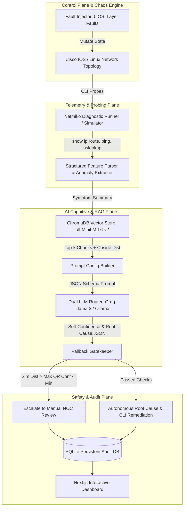

# NetSage ⚡ Autonomous AI Network Troubleshooting System

<div align="center">


**NetSage is an autonomous network troubleshooting system built around a Statistical Fallback Gatekeeper. In mission-critical enterprise networking, unjustified AI confidence is dangerous. When telemetry is ambiguous or out-of-distribution, NetSage actively refuses to guess, safely yielding control to human engineers with: "Insufficient evidence — escalate to manual diagnosis", while using RAG and dual-tier LLM orchestration for reliable, deterministic remediation when confident.**

[Quick Start](#-quick-start) • [Architecture](#-architecture) • [Supported Faults](#-supported-fault-taxonomy) • [Viva Voce Defensibility](#-viva-voce-defensibility)

</div>

---

## 📖 Overview

**NetSage** is a Computer Networking university project that demonstrates an end-to-end **closed-loop autonomous network troubleshooting system**. 

### 🛡️ The Headline Engineering Innovation: Defensive Fallback Gatekeeper
In mission-critical enterprise networking, **unjustified AI confidence is dangerous** — hallucinating an incorrect `shutdown` or deleting active BGP/OSPF peers can trigger wide-scale outages. 

NetSage implements a **Statistical Fallback Gatekeeper** that computes dual-threshold uncertainty boundaries ($d_{\text{min}} > 0.85$ or $C_{\text{LLM}} < 65\%$). When telemetry is ambiguous or out-of-distribution, NetSage **actively refuses to guess**, safely yielding control to human engineers with: `"Insufficient evidence — escalate to manual diagnosis"`.

---

## 🌟 Key Capabilities

> [!NOTE]
> **SIMULATED MODE BY DEFAULT:** To ensure 100% reproducible and zero-flake demonstrations during academic defense, this system runs in a deterministic simulated mode by default. While production-ready `netmiko` SSH and GNS3 REST API hooks exist in the codebase, they are not the active path. This eliminates external hypervisor dependencies and proves the core AI logic reliably.

- **Deterministic In-Memory Simulation Engine**: State-machine emulation of Cisco IOS and Linux POSIX CLI responses for reliable demonstrations without hypervisor crashes. 
- **Chaos Engineering Fault Deck**: Deterministic injection across OSI Layers 1 through 7 (`interface_down`, `subnet_misconfig`, `acl_blocking`, `routing_loop`, `dns_failure`).
- **Domain RAG via ChromaDB**: `sentence-transformers/all-MiniLM-L6-v2` dense vector retrieval over 8 curated network troubleshooting guides.
- **Dual-Tier LLM Orchestration**: Primary cloud inference via **Groq Llama 3.3 70B**, automated failover to **Local Ollama**, and an air-gapped deterministic expert fallback.
- **Interactive Web Terminal Console**: Direct in-browser Cisco IOS exec shell (`show ip route`, `ping`, `traceroute`, `show ip access-lists`).
- **Persistent SQLite Audit Database**: Full telemetry persistence with ground-truth accuracy tracking (`netsage_audit.db`).
- **Docker Compose One-Command Spinup**: Automated multi-container orchestration.

---

## 🏛 Architecture



---

## 🎯 Supported Fault Taxonomy

| OSI Layer | Fault Identifier | Injected Failure Mechanism | Diagnostic Signature | Recommended Remediation |
| :--- | :--- | :--- | :--- | :--- |
| **Layer 1/2** | `interface_down` | Administrative shutdown on gateway interface | `show ip int br` reports `administratively down`, 0% ping | `configure terminal`<br>`interface Gi0/1`<br>`no shutdown` |
| **Layer 3** | `subnet_misconfig` | Mismatched default gateway & invalid subnet mask | Host ping returns `Destination Host Unreachable` | `sudo ip route add default via 192.168.20.1` |
| **Layer 3/4** | `acl_blocking` | Extended ACL filtering inter-subnet IP packets | ICMP probe returns `Destination Administratively Prohibited` | `configure terminal`<br>`interface Gi0/0`<br>`no ip access-group RESTRICT_CAMPUS_TRAFFIC in` |
| **Layer 3** | `routing_loop` | Conflicting static route pointer between Core & HQ | `traceroute` shows repeating hops & TTL exceeded (`!H`) | `no ip route 192.168.20.0 255.255.255.0 10.1.13.1`<br>`ip route 192.168.20.0 255.255.255.0 10.1.23.1` |
| **Layer 7** | `dns_failure` | Nameserver pointed to unreachable IP (`192.0.2.53`) | `nslookup` connection timed out after 3 attempts | `echo 'nameserver 192.168.10.53' \| sudo tee /etc/resolv.conf` |

---

## 🚀 Quick Start

### Option A: Local Development

```bash
# 1. Clone the repository
git clone https://github.com/priyanshusharma-dev/NetSage.git
cd NetSage

# 2. Install Backend dependencies
pip install -r backend/requirements.txt
pip install chromadb sentence-transformers

# 3. Start FastAPI Backend (Port 8000)
python -m uvicorn backend.app.main:app --host 0.0.0.0 --port 8000 --reload

# 4. Start Next.js Frontend Dashboard (Port 3000)
cd frontend
npm install
npm run dev
```

Open **`http://localhost:3000`** in your browser. (Interactive API docs at **`http://localhost:8000/docs`**).

---

### Option B: Docker Compose (One-Click Launch)

```bash
docker-compose up --build
```

---

## 🧪 Testing

```bash
# Run isolated Pytest unit tests with mocked data:
pytest backend/tests/test_unit.py

# Run complete End-to-End pipeline verification:
python backend/tests/test_e2e_backend.py
```

---

## 🎓 Viva Voce Defensibility

Key discussion points for academic defense:
1. **Explainable AI**: The system never obscures RAG retrieval. Exact vector chunks, cosine distances, and source documents are displayed in the UI and SQLite audit logs.
2. **Defensible Deferral**: Demonstrates responsible AI by setting strict confidence gates to prevent dangerous hallucinated network configuration commands.
3. **Simulated-First Reliability**: Provides a guaranteed, zero-flake presentation environment without requiring complex GNS3 VM hardware bindings during examination.

---

## 📂 Project Structure

```text
NetSage/
├── .github/workflows/ci.yml       # GitHub Actions automated test & build CI
├── backend/
│   ├── app/
│   │   ├── collector/             # Netmiko runner, regex parsers, and telemetry schemas
│   │   ├── kb/                    # ChromaDB vector store & all-MiniLM-L6-v2 embeddings
│   │   ├── rag/                   # Prompt config, LLM router & Fallback Gatekeeper
│   │   ├── topology/              # 8-node Campus topology, GNS3 client & simulation engine
│   │   ├── config.py              # Global settings & threshold parameters
│   │   └── main.py                # FastAPI REST application
│   ├── tests/                     # Pytest unit & e2e verification suites
│   ├── Dockerfile                 # Backend container definition
│   └── requirements.txt           # Python dependencies
├── frontend/
│   ├── src/
│   │   ├── app/                   # Next.js 14 App Router (page.tsx, globals.css)
│   │   ├── components/            # UI components (TopologyView, Terminal, Radial Gauge, etc.)
│   │   └── types/                 # Strongly typed TypeScript interfaces
│   ├── Dockerfile                 # Frontend container definition
│   └── package.json               # Frontend Node dependencies
├── knowledge_base/
│   └── source_docs/               # 8 curated markdown network troubleshooting guides
├── docs/                          # Viva voce examination guide & failure case analysis
├── docker-compose.yml             # Container orchestration
├── .env.example                   # Template environment variables
├── .gitignore                     # Repository ignore rules
├── LICENSE                        # MIT License
└── README.md                      # Project documentation
```

---

## 📜 License
This project is licensed under the MIT License - see the [LICENSE](LICENSE) file for details.
